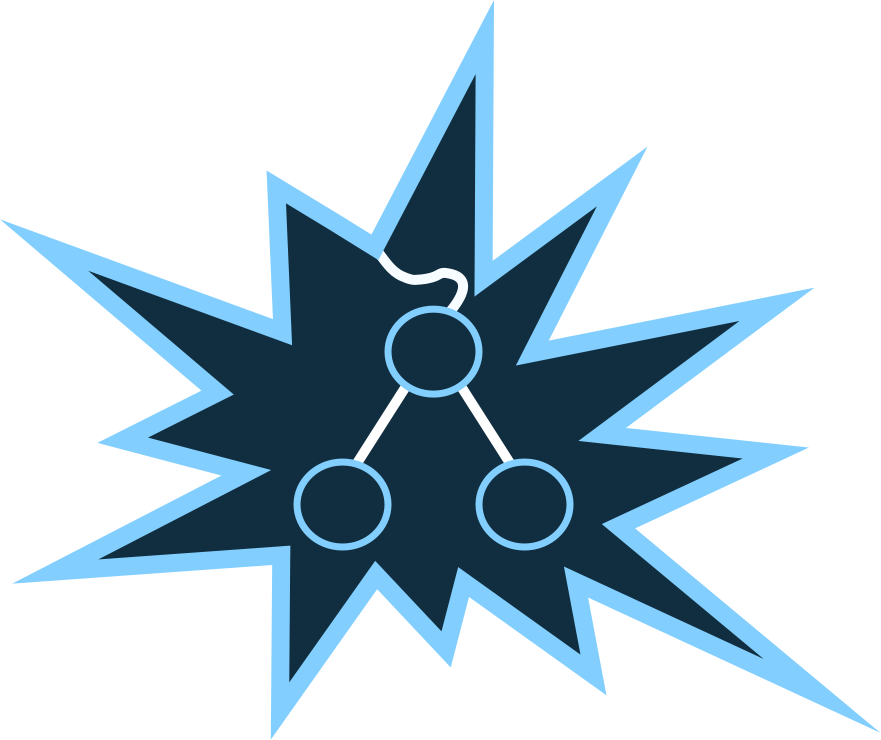

<p align="center">
  
</p>
<h1 style="color: #112E40"align="center">Dastructs</h1>
> A Pack of Novelty Data Structures

[](https://travis-ci.org/kennetpostigo/dastructs)
[](https://coveralls.io/github/kennetpostigo/dastructs?branch=master)
[](http://npm.im/dastructs)
[](http://npm-stat.com/charts.html?package=dastructs&from=2015-08-01)
[](http://opensource.org/licenses/MIT)


Dastructs is a neat dependency-free library packed with novelty data structures
and polymorphic functions that operate on them. Dastructs is short for (Da)ta
(Struct)ures. Aside from it being a library that you can use to model data in your
applications with it is also a source for people interested in learning about
data structures in a friendly language like javascript.

## Goal
Dastructs is currently at an early stage. All data structures are implemented with
the minimal amount of functionality. I will be working on adding more functionality
while also trying to prevent as much bloat as possible.

There are a few critical steps I want to take to help make data structures approachable
for people without a Computer Science Degree:
+ [ ] __Create a github page for the library that details the use case for each data structure and their methods__

+ [ ] __Provide explanations of the source of the data structures in a section of the github page__

+ [ ] __Provide resources for further exploration of data structures__


## Data Structures included:
 + AVL Tree
 + Binary Search Tree
 + Binary Tree
 + Dictionary
 + Graph
 + LinkedList
 + Map
 + PriorityQueue
 + Queue
 + Red Black Tree
 + Seq
 + Set
 + Stack
 + Trie

## Contributing
If you are willing to help make the data structures better and want to contribute
in any way whether it be code, suggestions, or feedback I would greatly appreciate
it.

#### Prerequisites
+ You have `node v6.0.0+` and `npm v3.8.0`

#### Build
Once you clone the repository do the following:
```bash
# Install Development Dependencies
npm Install
```

#### Project Scripts
```bash
# Run Tests
npm test

# Watch Tests
npm run test:watch

# Receive Code Coverage Reporting
npm run report

# Run Tests and get Reports
npm run test:report

# Run flow to test your typing
npm run flow

# Create Development and Production builds
npm run build:publish
```
## License
MIT
